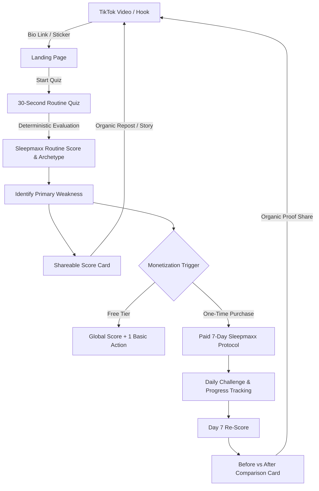

# SOURCE OF TRUTH

> **CRITICAL OPERATING PRINCIPLE**: This document is the durable, authoritative source of truth for the Sleepmaxx product. All future architectural, technical, product, and design decisions must be validated against this specification. If a future user request, prompt, or implementation task conflicts with this PRD, the conflict must be explicitly identified and resolved rather than silently overriding this document.

---

# Sleepmaxx — Product Requirements Document (PRD)

## 1. Executive Summary

**Sleepmaxx** is a mobile-first, zero-backend, viral web application and Progressive Web App (PWA) designed to gamify sleep routine improvement for Gen Z and young adults.

* **Working Name**: Sleepmaxx
* **Core Promise**: *"Discover your Sleepmaxx Score. Can you reach 90 in 7 days?"*
* **Official Metric**: Sleepmaxx Routine Score (0–100 points, deterministic, calculated client-side).
* **Current Status**: Phase 0 completed. React 19 + TypeScript + Vite + Native CSS + `vite-plugin-pwa` + Vitest configured; pure deterministic scoring engine implemented and validated (77/77 tests passing); production build verified.
* **Target Audience**: 18–24 year olds (Gen Z, students, gym/fitness, self-improvement, glow-up communities on TikTok/Instagram).
* **Business Target**: Accumulate approximately **1,000,000 FCFA** in cumulative revenue by December 31, 2026.

---

## 2. Product Origin & Strategic Reasoning

The product was inspired by the business model of high-velocity viral calculator and predictor applications.

### 2.1 The Reference Mechanism
```
Simple Inputs 
  → Deterministic Calculation 
  → Visually Compelling Result 
  → Shareable Output Asset 
  → Monetized Deeper Solution 
  → Repeat Usage / Rescore
```

### 2.2 Application to Sleepmaxx
Sleepmaxx adapts this viral calculator loop to sleep hygiene and daily habits:
1. **Low Friction**: A 30-second, 5-question questionnaire evaluating *declared* habits.
2. **Instant Feedback**: An immediate numeric score (0–100) and polarizing Gen-Z archetype (e.g., "COOKED", "ZOMBIE", "ELITE").
3. **Distribution Asset**: A visually striking, high-contrast dark card tailored for TikTok, Instagram Stories, and direct messages.
4. **Immediate Paid Value**: A targeted one-time digital purchase ("7-Day Sleepmaxx Protocol") specifically curing the user's primary identified routine weakness.

---

## 3. Problem Statement

1. **Inconsistent Youth Sleep Routines**: Young adults suffer from erratic bedtime schedules, prolonged blue light exposure in bed, poorly timed caffeine intake, and minimal morning sunlight. These habits depress daytime alertness, athletic recovery, and cognitive focus.
2. **Hardware Friction & Cost**: Established sleep tracking requires expensive wearables ($300+ hardware or $30/month subscriptions like Whoop, Oura, or Apple Watch).
3. **Surveillance Discomfort**: Many users reject invasive microphone and camera sleep monitors.
4. **Clinical Overwhelm**: Existing medical sleep apps present sterile, clinical dashboards lacking emotional resonance, urgency, or viral shareability for younger demographics.

---

## 4. Opportunity

* **Cultural Wave**: "Looksmaxxing", "glow-up", and biohacking subcultures have normalized score-based self-optimization among 18–24 year olds on TikTok and Instagram.
* **Shareable Status**: Users actively share quiz outcomes, personality archetypes, and routine rankings to signal discipline or humorously commiserate over poor habits ("I'm literally COOKED").
* **Low Barrier, High Velocity**: A zero-hardware, local-first web app accessed directly via a link in a TikTok bio delivers instant gratification without App Store download friction.

---

## 5. Business Objective

* **Financial Objective**: Reach approximately **1,000,000 FCFA** in cumulative revenue by **December 31, 2026**.
* **Nature of the Objective**: This is a strategic business target, **not a guaranteed forecast**.
* **Guiding Principles**:
  * Fast launch over perfection.
  * Near-zero operating costs (static hosting, client-side execution).
  * Organic social distribution (TikTok/IG).
  * High viral coefficient via shareable scorecards.
  * Transparent paid value proposition.
  * Frictionless conversion.

---

## 6. Target Audience

### 6.1 Primary Demographic (V1)
* **Age Group**: 18–24 years old.
* **Core Segments**:
  * College and university students.
  * Gen Z self-improvement and productivity enthusiasts.
  * Fitness, gym, and bodybuilding communities prioritizing physical recovery.
  * "Glow-up" and looksmaxxing subcultures seeking aesthetic and hormonal recovery benefits.
  * Morning routine and discipline creators.
  * Active TikTok and Instagram consumers.

### 6.2 Audience Constraints
* **Minors**: V1 marketing and funnels must **not** intentionally target minors. Copy and positioning target young adults (18+).

---

## 7. Positioning & Boundary Declarations

Sleepmaxx is strictly a **wellness and gamification application**. It evaluates the user's **DECLARED sleep routine habits**.

```
┌─────────────────────────────────────────────────────────────┐
│                      WHAT SLEEPMAXX IS                      │
├─────────────────────────────────────────────────────────────┤
│  • A gamified sleep-routine assessment tool                 │
│  • A habit-awareness and self-improvement challenge          │
│  • A viral social sharing experience                        │
│  • A structured 7-day habit protocol                        │
└─────────────────────────────────────────────────────────────┘

┌─────────────────────────────────────────────────────────────┐
│                    WHAT SLEEPMAXX IS NOT                    │
├─────────────────────────────────────────────────────────────┤
│  ✕ Does NOT measure actual sleep duration or latency        │
│  ✕ Does NOT detect or analyze sleep stages (REM, Deep, etc.) │
│  ✕ Does NOT diagnose insomnia, apnea, or sleep disorders    │
│  ✕ Does NOT measure hormones (cortisol, melatonin, etc.)    │
│  ✕ Does NOT calculate biological age                        │
│  ✕ Does NOT provide medical diagnosis or clinical treatment │
│  ✕ Does NOT claim clinical or medical validation            │
└─────────────────────────────────────────────────────────────┘
```

---

## 8. Core Value Proposition

> **"Discover your Sleepmaxx Score. Can you reach 90 in 7 days?"**

* **Clarity**: Instant numeric rating of routine health from 0 to 100.
* **Diagnosis**: Precise identification of the single biggest routine leak (e.g., Caffeine Timing or Screen Habit).
* **Challenge**: A time-boxed, 7-day roadmap taking the user from suboptimal habit states to elite discipline.

---

## 9. Product Loop



---

## 10. Core User Journey

1. **Discovery**: User views a TikTok video ("Comment your bedtime and wake-up time, I'll calculate your score" or "Can your routine reach 90?").
2. **Landing**: User taps bio link, arriving on a dark, high-contrast mobile-optimized landing screen.
3. **Assessment**: User answers 5 questions (under 30 seconds):
   * Average sleep duration.
   * Weekend vs weekday bedtime shift.
   * Last caffeine consumption timing before sleep.
   * Screen time in bed before sleeping.
   * Natural morning sunlight exposure.
4. **Reveal**: Instant calculation produces:
   * Overall Score (e.g., 54/100).
   * Archetype Label (e.g., "ZOMBIE").
   * Category Breakdown.
   * Primary Weakness (e.g., "Screen Habit (-6 pts)").
5. **Viral Distribution**: User downloads or shares the custom scorecard to social media.
6. **Conversion Trigger**: User is presented with the option to unlock the tailored "7-Day Sleepmaxx Protocol" to eliminate their primary weakness and target a 90+ score.
7. **Protocol Execution**: User tracks daily micro-actions across 7 days.
8. **Re-Score & Proof**: User retakes the assessment on Day 7, generates a "Before / After" scorecard, and shares the result.

---

## 11. Free vs. Paid Experience

### 11.1 Free Experience (Acquisition & Virality Engine)
The free experience is designed to maximize completion, delight, and viral distribution.

* **Included Features**:
  * Global Sleepmaxx Routine Score (0–100).
  * Full 5-category score breakdown.
  * Identification of the primary routine weakness.
  * One actionable basic recommendation to improve.
  * Downloadable/shareable branded scorecard.
* **NON-NEGOTIABLE RULE**: **The score itself must NEVER be paywalled.** Paywalling the score destroys the viral loop and acquisition funnel.

### 11.2 Paid Experience: "7-Day Sleepmaxx Protocol"
The paid tier converts high-intent users seeking a structured, step-by-step roadmap.

* **Product Type**: One-time digital purchase (NO recurring subscription at launch).
* **Indicative Test Price Range**: **$4.99 – $7.99** (pricing must be experimentally tested and not hard-coded into product logic).
* **Included Features**:
  * Tailored 7-day routine transformation protocol focused on the user's primary bottleneck.
  * Daily actionable challenges (Day 1 through Day 7).
  * Interactive daily checklist and streak tracking.
  * Daily projected score progression.
  * End-of-protocol re-score mechanism.
  * Dynamic "Before vs. After" comparative scorecard.
  * Final completion certificate / badge.

---

## 12. Scoring Model Specification

The scoring engine is completely deterministic, executed locally on the client with zero external dependencies.

* **Total Possible Points**: 100
* **Evaluation Dimensions**: 5 categories

```
┌──────────────────────────────────────┬────────────┐
│ Category                             │ Max Points │
├──────────────────────────────────────┼────────────┤
│ 1. Sleep Duration                    │  35 points │
│ 2. Sleep Consistency (Weekend Shift) │  25 points │
│ 3. Caffeine Timing                   │  20 points │
│ 4. Screen Habit                      │  10 points │
│ 5. Morning Light Exposure            │  10 points │
├──────────────────────────────────────┼────────────┤
│ TOTAL                                │ 100 points │
└──────────────────────────────────────┴────────────┘
```

### 12.1 Sleep Duration (35 Points)
Evaluates declared average continuous nocturnal sleep:

| Declared Sleep Duration | Points Awarded | Rational / Bracket |
| :--- | :---: | :--- |
| `< 5.0 hours` | **0** | Severe sleep deprivation |
| `5.0 – 5.99 hours` | **10** | Insufficient |
| `6.0 – 6.99 hours` | **22** | Sub-optimal |
| `7.0 – 8.99 hours` | **35** | Optimal physiological range |
| `9.0 – 9.99 hours` | **33** | Extended duration |
| `10.0+ hours` | **30** | Oversleeping / recovery debt |

*Input Sanitization Rule*: Lower bound clamped to 0. Non-finite (`NaN`, `Infinity`) or negative values resolve to 0 points (worst case).

### 12.2 Sleep Consistency / Social Jetlag (25 Points)
Evaluates absolute difference between weekday and weekend bedtimes:

| Bedtime Shift (Hours) | Points Awarded | Impact Level |
| :--- | :---: | :--- |
| `0.0 hours` | **25** | Perfect circadian lock |
| `> 0.0 and < 1.0 hour` | **22** | Minimal circadian drift |
| `1.0 – 1.99 hours` | **17** | Moderate drift |
| `2.0 – 2.99 hours` | **10** | High social jetlag |
| `3.0+ hours` | **0** | Severe circadian disruption |

*Input Sanitization Rule*: Higher shift is worse. Non-finite values (`NaN`, `Infinity`) map to worst case (0 points).

### 12.3 Caffeine Timing (20 Points)
Evaluates hours between last caffeine consumption and planned bedtime:

| Cutoff Timing Prior to Bedtime | Points Awarded | Biological Impact |
| :--- | :---: | :--- |
| `No caffeine consumed` | **20** | Zero adenosine receptor interference |
| `8.0+ hours before bed` | **20** | Optimal clearance window |
| `6.0 – 7.99 hours` | **18** | Minor residual clearance |
| `4.0 – 5.99 hours` | **14** | Active clearance window |
| `2.0 – 3.99 hours` | **7** | High circulating caffeine |
| `< 2.0 hours before bed` | **0** | Severe sleep latency/architecture impairment |

*Input Sanitization Rule*: Non-finite values or negative hours map to 0 points.

### 12.4 Screen Habit in Bed (10 Points)
Evaluates active smartphone, tablet, or monitor usage while in bed before sleeping:

| Screen Minutes in Bed | Points Awarded | Impact Level |
| :--- | :---: | :--- |
| `0 minutes` | **10** | Optimal melatonin release |
| `> 0 and < 15 minutes` | **9** | Minimal blue light exposure |
| `15 – 29 minutes` | **7** | Moderate alertness stimulation |
| `30 – 59 minutes` | **4** | Delayed sleep phase |
| `60+ minutes` | **0** | Severe dopaminergic and light disruption |

*Input Sanitization Rule*: Higher minutes is worse. `NaN` or `Infinity` maps to 0 points.

### 12.5 Morning Light Exposure (10 Points)
Evaluates frequency of direct outdoor sunlight exposure within 60 minutes of waking:

| Frequency Selection | Points Awarded | Impact Level |
| :--- | :---: | :--- |
| `almost_always` | **10** | Immediate cortisol peak and circadian alignment |
| `often` | **7** | Regular entrainment |
| `rarely` | **3** | Infrequent light cue |
| `never` | **0** | Circadian drift / delayed phase |

---

## 13. Archetypes & Scoring Buckets

The final score strictly determines the user's archetype classification:

```
Score:  0        40          60            75           90      100
        [ COOKED ) [ ZOMBIE  ) [ RECOVERING ) [SLEEPMAXXED) [ ELITE ]
```

| Score Range | Archetype Code | Display Label | Description & Emotional Framing |
| :---: | :---: | :---: | :--- |
| **0 – 39** | `COOKED` | **COOKED** | Severe routine dysregulation. High urgency, meme-worthy, immediate turnaround needed. |
| **40 – 59** | `ZOMBIE` | **ZOMBIE** | Operating on chronic sleep debt and inconsistent cues. Low daytime energy. |
| **60 – 74** | `RECOVERING` | **RECOVERING** | Decent baseline with 1–2 major leaks dragging down recovery. |
| **75 – 89** | `SLEEPMAXXED` | **SLEEPMAXXED** | Disciplined routine. Above-average habits, minor adjustments required for perfection. |
| **90 – 100** | `ELITE` | **ELITE** | Mastered sleep hygiene. Circadian rhythm synchronized, top 1% routine discipline. |

---

## 14. Weakness Calculation & Tie-Breaking Logic

To provide personalized value and drive protocol relevance, the engine identifies the single category with the greatest lost points.

### 14.1 Formula
$$\text{Lost Points} = \text{Category Max Points} - \text{Earned Category Points}$$

The category with the maximum lost points is designated as the primary `weakness`.

### 14.2 Strict Tie-Breaking Order
When two or more categories have identical lost point totals, ties are broken strictly in the following sequence:
1. `duration` (highest biological impact)
2. `consistency`
3. `caffeine`
4. `screen`
5. `morningLight`

*Reference Implementation*: [`src/core/scoringEngine.ts`](file:///home/hasashi/Bureau/SLEEPMAXX/src/core/scoringEngine.ts).

---

## 15. Brand, Visual, & UX Direction

* **Form Factor**: Mobile-first responsive web design. Primary testing viewport: 375px – 430px width.
* **Theme**: Deep dark mode (slate/obsidian/true black backgrounds `#0B0F17` / `#05070A`).
* **Visual Style**: High-contrast, glowing accents (cyber-mint, neon emerald, alert crimson for low scores), clean typography (system sans-serif / modern grotesque).
* **Tone**: Bold, Gen-Z fluent, direct, gamified, non-clinical.
* **Screenshot Optimization**: Result card formatted as a high-density, 9:16 or 4:5 visual asset suitable for direct posting on TikTok stories, Instagram stories, or group chats.
* **Strict Exclusions**:
  * No sterile clinical dashboards.
  * No hospital blues or medical cross iconography.
  * No dense medical terminology.

---

## 16. Growth & Viral Distribution Strategy

### 16.1 Primary Acquisition Channel
* **TikTok Organic**: Creator-led and faceless TikTok accounts.
* **Core Conversion Hooks**:
  * *"Comment your bedtime + wake-up time and I'll tell you your Sleepmaxx score."*
  * *"Can anyone actually reach 90 on this?"*
  * *"I thought getting 8 hours made me healthy until I got a 52."*
  * *"Your 10 PM iced coffee is literally cooking your score."*

### 16.2 Viral Loop Mechanics
```
User takes quiz 
  → Gets surprising or polarizing score (e.g. 48 "ZOMBIE") 
  → Shares visual scorecard to TikTok/IG 
  → Followers experience curiosity / challenge 
  → Follower opens bio link 
  → Loop repeats
```

### 16.3 Distribution Assets
* **Shareable Score Card**: Contains Overall Score, Archetype Badge, Primary Leak highlight, and clean branded watermark (`sleepmaxx.app` / link).
* **Native Sharing**: Support `navigator.share` on supported mobile devices with seamless fallback to image copy/download.

---

## 17. Monetization Strategy

* **Model**: Digital One-Time Purchase for the "7-Day Sleepmaxx Protocol".
* **Indicative Price Range**: **$4.99 – $7.99** (evaluated and tuned via experimental A/B testing; not hardcoded).
* **Rationale**: Subscription models introduce excessive churn and credit card anxiety for young Gen-Z users. A low-friction micro-transaction aligns with impulse digital purchases.
* **Conversion Moment**: Triggered on the result screen immediately after revealing the user's primary weakness, framing the protocol as the specific solution to reach 90+ in 7 days.
* **Fulfillment**: Immediate client-side unlock persisted via `localStorage` upon receipt of client/webhook purchase verification token.

---

## 18. Technical Architecture & Constraints

### 18.1 Stack
* **Framework**: React 19 + TypeScript.
* **Build System**: Vite 8.3.0.
* **Styling**: Native CSS (CSS Modules / CSS variables; no heavy utility libraries).
* **Offline / PWA**: `vite-plugin-pwa` with service worker registration.
* **Testing**: Vitest (pure unit tests with complete branch coverage).
* **Persistence**: Client-side `localStorage` for user answers, results, and protocol progress.

### 18.2 Architecture Principles
1. **Zero Scoring API Dependency**: All calculations run locally in `<1ms` via pure functions.
2. **No Backend Initially**: Static deployment on edge CDN (Netlify, Vercel, or Cloudflare Pages).
3. **No Database**: User state resides on device.
4. **No AI in Critical Path**: No LLM latency, cost, or hallucination in the core scoring or protocol generation.
5. **No Mandatory User Authentication**: Frictionless entry without email/password barriers.

---

## 19. Zero-Budget Operating Constraints

The project operates under a strict bootstrapped, zero-capital philosophy:
* **Hosting**: Free-tier static site hosting (Cloudflare Pages / Vercel / Netlify).
* **Tooling**: Free and open-source packages exclusively.
* **Zero Usage Fees**: No per-calculation or per-user API bills.
* **Distribution First**: Web/PWA avoids $99/year Apple Developer account fees and App Store approval delays during validation. Native wrapper stores (Capacitor/TWA) reserved for Phase 5.

---

## 20. Analytics & Key Performance Indicators (KPIs)

### 20.1 Primary KPI
* **Cumulative Revenue**: Progress toward the 1,000,000 FCFA milestone.
* **Paying Customer Count**: Total volume of distinct, paying unknown users.

> *Note*: App downloads and landing page hits are strictly secondary. Real conversion and cash flow take priority over vanity metrics.

### 20.2 Funnel Metrics
```
1. TikTok Impressions / Views
   └── 2. Profile Clicks
       └── 3. Landing Page Visits
           └── 4. Quiz Starts
               └── 5. Quiz Completions
                   └── 6. Score Generations
                       ├── 7a. Result Shares / Downloads (Viral Branch)
                       └── 7b. Paywall Impressions (Monetization Branch)
                           └── 8. Checkout Initiations
                               └── 9. Completed Purchases
                                   ├── 10. Day-2 Protocol Return
                                   └── 11. Day-7 Re-score Completion
```

---

## 21. Health, Safety, & Legal Copy Boundaries

Sleepmaxx copy must maintain rigorous compliance with health claims standards.

### 21.1 Prohibited Statements
User-facing copy must **NEVER**:
* Claim or imply medical diagnosis, prognosis, or treatment.
* Guarantee specific biological, hormonal, or physiological changes.
* Claim direct measurement of hormones (melatonin, cortisol, growth hormone).
* Promise guaranteed increases in testosterone, height, or facial structure.
* Claim cure or prevention of clinical sleep disorders (e.g., sleep apnea, clinical insomnia, narcolepsy).

### 21.2 Mandatory Disclaimers
* Display a clear disclaimer: *"Sleepmaxx is a gamified sleep habit routine assessment designed for wellness and informational purposes. It is not medical advice, diagnosis, or clinical sleep monitoring."*
* Every scientific reference in explanatory copy must be verified against standard sleep hygiene literature prior to deployment.

---

## 22. Product Roadmap

```
┌─────────────────────────────────────────────────────────────────────────────┐
│ PHASE 0: FOUNDATION [COMPLETED]                                             │
│ • Vite + React + TypeScript + PWA + Vitest                                  │
│ • Pure deterministic scoring engine with 100% branch test coverage (77/77)   │
│ • TypeScript compilation & production build verified                        │
└─────────────────────────────────────────────────────────────────────────────┘
                                      │
                                      ▼
┌─────────────────────────────────────────────────────────────────────────────┐
│ PHASE 1: CORE FUNNEL                                                        │
│ • Mobile-first landing page with viral hooks                                │
│ • 5-step interactive questionnaire with smooth transitions                  │
│ • Result presentation with archetype badges & weakness highlight           │
│ • Dynamic scorecard generator & social share integration                    │
└─────────────────────────────────────────────────────────────────────────────┘
                                      │
                                      ▼
┌─────────────────────────────────────────────────────────────────────────────┐
│ PHASE 2: MONETIZATION                                                       │
│ • "7-Day Sleepmaxx Protocol" paywall modal & sales screen                   │
│ • Checkout integration (Stripe / Lemon Squeezy / local gateway)             │
│ • Purchase confirmation, token verification, and persistent access unlock   │
└─────────────────────────────────────────────────────────────────────────────┘
                                      │
                                      ▼
┌─────────────────────────────────────────────────────────────────────────────┐
│ PHASE 3: RETENTION & CHALLENGE                                              │
│ • Day-by-day interactive 7-day protocol checklist                           │
│ • Daily streak tracking & local reminder prompt                             │
│ • Day 7 re-scoring assessment                                               │
│ • "Before vs. After" dynamic comparison card generator                      │
└─────────────────────────────────────────────────────────────────────────────┘
                                      │
                                      ▼
┌─────────────────────────────────────────────────────────────────────────────┐
│ PHASE 4: GROWTH OPTIMIZATION                                                │
│ • TikTok creative testing & organic content iteration                       │
│ • Viral share asset A/B testing                                             │
│ • Privacy-friendly lightweight analytics integration                        │
│ • Conversion rate optimization across paywall copy                          │
└─────────────────────────────────────────────────────────────────────────────┘
                                      │
                                      ▼
┌─────────────────────────────────────────────────────────────────────────────┐
│ PHASE 5: DISTRIBUTION EXPANSION                                             │
│ • Google Play Store release (Trusted Web Activity - TWA)                    │
│ • iOS App Store wrapper (Capacitor / WebKit wrapper)                        │
└─────────────────────────────────────────────────────────────────────────────┘
```

---

## 23. Explicit Non-Goals (V1 Exclusions)

To protect focus, speed, and budget, the following features are **explicitly excluded** from V1:
* **Hardware & Sensor Tracking**: No integration with wearables (Apple Watch, Oura, Whoop, Fitbit, Garmin).
* **Health Frameworks**: No Apple HealthKit or Google Health Connect sync.
* **Surveillance Detection**: No audio/microphone snore monitoring; no camera sleep tracking.
* **AI Chatbots / Coaches**: No dynamic LLM chat interfaces or real-time AI conversational agents.
* **User Accounts**: No passwords, OAuth, or account registration databases.
* **Social Network Features**: No in-app friend feeds, comments, or direct messaging.
* **Complex Backend Infrastructure**: No custom server runtimes, databases, or microservices.

---

## 24. Open Decisions

1. **Payment Gateway Provider**: Finalizing the checkout provider (Stripe vs. Lemon Squeezy vs. Paddle or local payment aggregator) that seamlessly supports international credit cards and regional payment options.
2. **Pricing Elasticity**: Live A/B testing to identify optimal price point within the $4.99 – $7.99 range.
3. **Card Rendering Pipeline**: HTML Canvas dynamic image export vs. DOM screenshot capture for native mobile sharing.
4. **Analytics Tooling**: Selecting a zero-cost, privacy-focused analytics service (Cloudflare Web Analytics, Plausible, or Umami).

---

## 25. Source-of-Truth & Governance Rules

1. **Supremacy**: This PRD supersedes conversational suggestions or speculative feature ideas.
2. **Conflict Resolution**: If an incoming technical prompt, task, or user instruction directly conflicts with any rule or specification in this document:
   * The engineer/agent must halt and explicitly state the discrepancy.
   * The PRD must be updated via deliberate consensus before proceeding with conflicting code.
3. **Engine Alignment**: The scoring implementation in [`src/core/scoringEngine.ts`](file:///home/hasashi/Bureau/SLEEPMAXX/src/core/scoringEngine.ts) and its test suite [`src/core/scoringEngine.test.ts`](file:///home/hasashi/Bureau/SLEEPMAXX/src/core/scoringEngine.test.ts) serve as the mathematical and unit contract for Section 12, 13, and 14.
