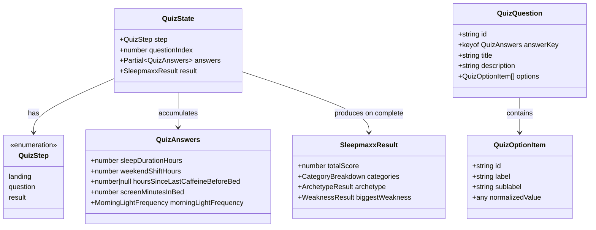
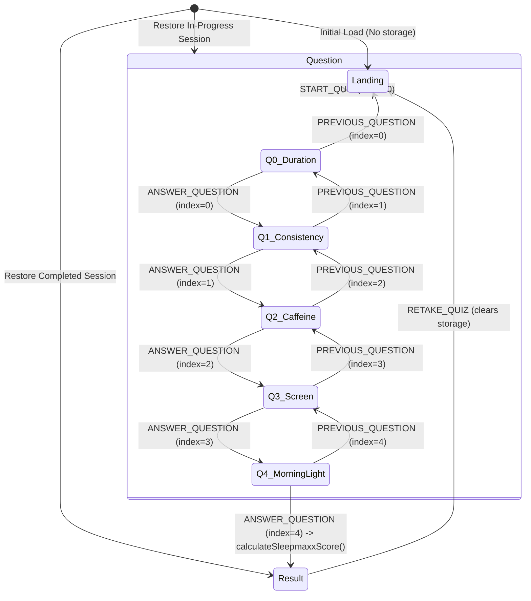

# Phase 1 Data Model: Sleepmaxx Quiz

**Feature**: `specs/001-sleepmaxx-quiz`
**Status**: Completed

## 1. Entities & Type Definitions



### 1.1 State Types (`src/features/quiz/types.ts`)

```typescript
import type { 
  QuizAnswers, 
  SleepmaxxResult, 
  MorningLightFrequency,
  SleepmaxxCategory,
  SleepmaxxArchetype 
} from '../../core/scoringEngine';

export type QuizStep = 'landing' | 'question' | 'result';

export interface QuizState {
  readonly step: QuizStep;
  readonly questionIndex: number; // 0 to 4 while step === 'question'
  readonly answers: Readonly<Partial<QuizAnswers>>;
  readonly result: Readonly<SleepmaxxResult> | null;
}

export type QuizAction =
  | { type: 'START_QUIZ' }
  | { type: 'ANSWER_QUESTION'; payload: { key: keyof QuizAnswers; value: QuizAnswers[keyof QuizAnswers] } }
  | { type: 'PREVIOUS_QUESTION' }
  | { type: 'RETAKE_QUIZ' }
  | { type: 'RESTORE_SESSION'; payload: QuizState };
```

### 1.2 Configuration & Schema Types

```typescript
export interface QuizOptionItem<T> {
  readonly id: string;
  readonly label: string;
  readonly sublabel?: string;
  readonly normalizedValue: T;
}

export interface QuizQuestion<K extends keyof QuizAnswers = keyof QuizAnswers> {
  readonly id: string;
  readonly answerKey: K;
  readonly stepNumber: number; // 1 to 5
  readonly title: string;
  readonly description?: string;
  readonly options: readonly QuizOptionItem<QuizAnswers[K]>[];
}
```

### 1.3 Persistence Schema (`localStorage`)

```typescript
export interface PersistedQuizSession {
  readonly version: 1;
  readonly updatedAt: number; // epoch ms
  readonly step: QuizStep;
  readonly questionIndex: number;
  readonly answers: Partial<QuizAnswers>;
  readonly result: SleepmaxxResult | null;
}
```

---

## 2. State Transition Lifecycle



---

## 3. Validation & Invariants

1. **Question Index Bounds**: When `step === 'question'`, `0 <= questionIndex <= 4`. Any invalid index clamps to boundary.
2. **Deterministic Evaluation Gate**: Transition to `step === 'result'` can **only** occur when all 5 keys of `QuizAnswers` are defined:
   * `sleepDurationHours !== undefined`
   * `weekendShiftHours !== undefined`
   * `hoursSinceLastCaffeineBeforeBed !== undefined` (can be `null` or number)
   * `screenMinutesInBed !== undefined`
   * `morningLightFrequency !== undefined`
3. **No Scoring Calculation in State Machine**: The reducer invokes `calculateSleepmaxxScore(answers as QuizAnswers)` strictly as a pure transformer on the final step.
4. **Storage Corruption Tolerance**:
   * If stored data has invalid version, missing fields, or malformed types, `loadSessionFromStorage()` discards the corrupted entry and returns `null`.
