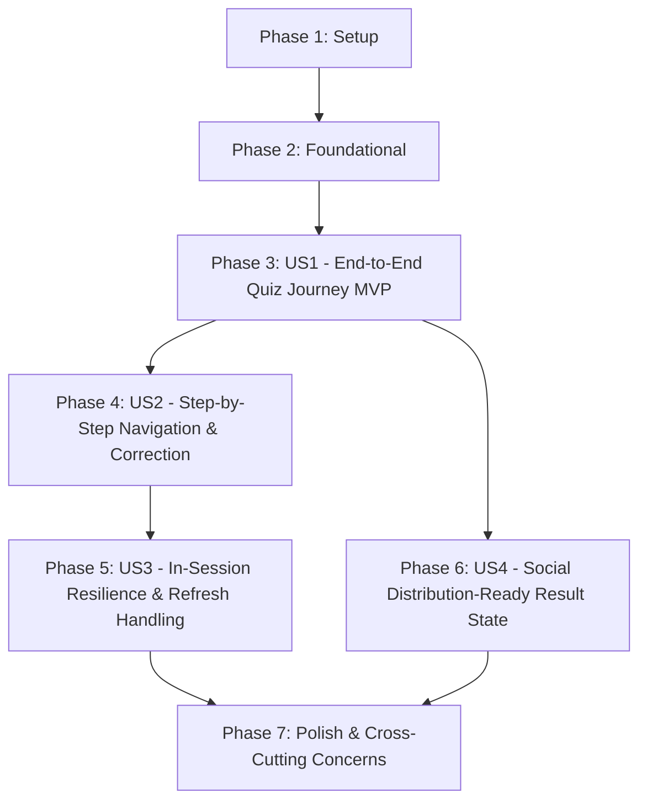

# Tasks: Sleepmaxx Quiz Funnel

**Feature**: `specs/001-sleepmaxx-quiz`  
**Spec**: [`specs/001-sleepmaxx-quiz/spec.md`](file:///home/hasashi/Bureau/SLEEPMAXX/specs/001-sleepmaxx-quiz/spec.md)  
**Plan**: [`specs/001-sleepmaxx-quiz/plan.md`](file:///home/hasashi/Bureau/SLEEPMAXX/specs/001-sleepmaxx-quiz/plan.md)  
**Status**: Ready for Implementation  

---

## Phase 1: Setup (Shared Infrastructure & Types)

**Purpose**: Scaffold the feature directory structure, define TypeScript contracts, and configure base design tokens.

- [X] T001 Create feature directory structure in `src/features/quiz/components/` and `src/features/quiz/data/` per implementation plan
- [X] T002 [P] Define feature domain types in `src/features/quiz/types.ts` (`QuizStep = 'landing' | 'question' | 'result'`, `QuizState`, `QuizAction`, `QuizQuestion`, `QuizOptionItem`, `PersistedQuizSession` with `version: 1`) importing scoring types from `src/core/scoringEngine.ts`
- [X] T003 [P] Configure design tokens and base styles in `src/index.css` (dark theme `#0B0F17`, high contrast text, glowing accents, mobile layout container `max-width: 440px`, `100dvh`, touch target `min-height: 52px`)

---

## Phase 2: Foundational (Blocking Prerequisites)

**Purpose**: Core question data, storage adapter, and pure state machine that MUST be complete before UI components can be built.

**⚠️ CRITICAL**: No user story UI work can begin until this phase is complete.

- [X] T004 [P] Implement static question configuration and normalized option mappings in `src/features/quiz/data/questions.ts` for all 5 questions:
  - Q1: `sleepDurationHours` verbatim values `[4.5, 5.5, 6.5, 8.0, 9.5, 10.5]`
  - Q2: `weekendShiftHours` verbatim values `[0.0, 0.5, 1.5, 2.5, 3.5]`
  - Q3: `hoursSinceLastCaffeineBeforeBed` verbatim values `[null, 9.0, 7.0, 5.0, 3.0, 1.0]`
  - Q4: `screenMinutesInBed` verbatim values `[0, 10, 20, 45, 75]`
  - Q5: `morningLightFrequency` verbatim values `['almost_always', 'often', 'rarely', 'never']`
- [X] T005 [P] Implement storage adapter in `src/features/quiz/storage.ts` (`QuizStorage` interface: `loadSession()`, `saveSession(state)`, `clearSession()` managing key `'sleepmaxx_quiz_session_v1'` with schema validation, corrupted payload recovery returning `null`, and `try/catch` error tolerance)
- [X] T006 [P] Create unit tests for storage adapter in `src/features/quiz/storage.test.ts` (test serialization, deserialization, corrupted JSON recovery, version mismatch handling, storage unavailable fallback, and `clearSession` purge)
- [X] T007 Implement state machine reducer and `useQuizState` hook in `src/features/quiz/useQuizState.ts` with initial state `{ step: 'landing', questionIndex: 0, answers: {}, result: null }`, handling actions `START_QUIZ`, `ANSWER_QUESTION`, `PREVIOUS_QUESTION`, `RETAKE_QUIZ`, and `RESTORE_SESSION`, triggering `calculateSleepmaxxScore(answers)` strictly on Question 5 completion
- [X] T008 Create unit tests for state machine and reducer in `src/features/quiz/useQuizState.test.ts` (test initial state, `START_QUIZ`, answer accumulation across 5 questions, scoring trigger invariant when all 5 keys defined, `PREVIOUS_QUESTION` bounds clamping `0 <= questionIndex <= 4`, and `RETAKE_QUIZ` reset)

**Checkpoint**: Foundation ready — all core models, data, storage, and state machine transitions tested. UI implementation can now begin.

---

## Phase 3: User Story 1 - End-to-End Quiz Journey (Priority: P1) 🎯 MVP

**Goal**: A user enters from Landing, answers 5 questions via touch options with 150ms auto-advance without a "Next" button, and immediately views their deterministic score, archetype, and primary weakness calculated by the pure scoring engine.

**Independent Test**: Launch app at Landing, tap Start Quiz, tap options for Questions 1 to 5 with auto-advance, and verify that the Result view displays the exact score (0–100), archetype badge, category breakdown, and biggest weakness matching `src/core/scoringEngine.ts`.

### Implementation for User Story 1

- [X] T009 [P] [US1] Create progress indicator component in `src/features/quiz/components/ProgressBar.tsx` (renders visual bar and step label "Question X of 5", progress 20% to 100%)
- [X] T010 [P] [US1] Create landing view component in `src/features/quiz/components/LandingScreen.tsx` (displays "Sleepmaxx" header, core promise "Discover your Sleepmaxx Score. Can you reach 90 in 7 days?", and primary CTA "Start Quiz" button)
- [X] T011 [US1] Create question view component with auto-advance in `src/features/quiz/components/QuestionScreen.tsx` (renders single question with options; on tap: immediately applies selected visual state, waits ~150ms visual highlight delay for tactile feedback, gates rapid multi-taps, and auto-advances to next question; no "Next" button)
- [X] T012 [P] [US1] Create result view component in `src/features/quiz/components/ResultScreen.tsx` (renders calculated score 0–100, archetype badge, primary weakness with points lost, category breakdown, non-medical wellness disclaimer, and retake action)
- [X] T013 [US1] Implement main feature container orchestrator in `src/features/quiz/components/QuizContainer.tsx` (binds `useQuizState`, conditionally renders `LandingScreen`, `QuestionScreen`, or `ResultScreen`, passes action callbacks)
- [X] T014 [US1] Connect `QuizContainer` into root application in `src/App.tsx`
- [X] T015 [US1] Create integration test for the end-to-end happy path in `src/features/quiz/QuizContainer.test.tsx` (simulates landing $\rightarrow$ start $\rightarrow$ 5 questions with auto-advance $\rightarrow$ result verification with 100/100 ELITE and non-medical disclaimer)

**Checkpoint**: User Story 1 is fully functional and testable independently as the minimal viable product (MVP).

---

## Phase 4: User Story 2 - Step-by-Step Navigation & Correction (Priority: P2)

**Goal**: Allow a user to navigate back between questions using the in-app Back button, preserving their previous selections, allowing answers to be updated and re-submitted via auto-advance without breaking the final evaluation.

**Independent Test**: Advance to Question 3, tap in-app Back, change Question 2 answer, re-advance forward to Question 5, complete quiz, and verify that the final score reflects the updated answer.

### Implementation for User Story 2

- [X] T016 [US2] Integrate in-app Back button into `src/features/quiz/components/QuestionScreen.tsx` (top-left back control; on Q1/index 0 calls back handler to return to landing; on Q2–Q5 calls `goToPreviousQuestion`; displays previously selected answer for current question; 100% in-app, zero `window.history` or `popstate` manipulation)
  *(Implemented: `selectedAnswer` prop added to `QuestionScreenProps`. `QuizContainer` derives `state.answers[currentQuestion.answerKey]` and passes it down. `QuestionScreen` uses `deriveSelectedOptionId()` as both `useState` initializer (SSR-safe) and `useEffect` sync. Pre-selection is visual-only — does NOT trigger auto-advance.)*
- [X] T017 [US2] Ensure downstream answer preservation during back/forward transitions in `src/features/quiz/useQuizState.ts` (when user moves back and changes an answer, existing answers for other questions remain intact in state)
  *(Verified: reducer `ANSWER_QUESTION` uses spread `{...state.answers, [key]: value}` — downstream answers inherently preserved. No code change needed, confirmed by integration tests.)*
- [X] T018 [US2] Add unit and integration tests for in-app back navigation and answer modification in `src/features/quiz/QuizContainer.test.tsx` (test navigating from Q3 to Q2 to Q1 to Landing, modifying Q2 answer, re-advancing, and asserting updated score calculation; verify zero dependency on `window.history.pushState`)
  *(Implemented: 8 new tests across 5 describe blocks — answer preservation, multi-step back, answer correction with score verification, Q1→landing, pre-selection rendering for numeric/null/undefined values, and browser history API absence assertion. Total: 119 tests passing.)*

**Checkpoint**: User Stories 1 AND 2 work seamlessly together without external router dependencies.

---

## Phase 5: User Story 3 - In-Session Resilience & Refresh Handling (Priority: P3)

**Goal**: Persist active quiz answers and results in `localStorage`, restore session seamlessly across browser refreshes, and handle Retake Quiz with a full reset to Landing and complete session purge.

**Independent Test**: Answer Questions 1 & 2, simulate page reload and verify resumption at Question 3. Complete quiz, click "Retake Quiz", verify full return to Landing and `localStorage` session purge.

### Implementation for User Story 3

- [ ] T019 [US3] Integrate automatic `localStorage` synchronization into `src/features/quiz/useQuizState.ts` (subscribes to state updates to persist session via `storage.saveSession`, and hydrates from `storage.loadSession` on mount)
- [ ] T020 [US3] Implement full Retake Quiz reset in `src/features/quiz/useQuizState.ts` and `src/features/quiz/components/ResultScreen.tsx` (invoking `retakeQuiz` calls `storage.clearSession()`, clears all recorded answers, deletes result, resets state machine, and returns to `landing`; flow: `Result → Retake → Landing → Start Quiz → Question 1`)
- [ ] T021 [US3] Add tests for persistence and retake flow in `src/features/quiz/QuizContainer.test.tsx` (test mid-quiz reload resumption, result reload preservation, and retake clearing `localStorage` and resetting to landing)

**Checkpoint**: State resilience and full retake reset are verified and tested.

---

## Phase 6: User Story 4 - Social Distribution-Ready Result State (Priority: P3)

**Goal**: Structure the result screen into a dedicated, visually impactful, screenshot-ready `<ScoreCard />` component formatted for vertical mobile capture (9:16 aspect ratio).

**Independent Test**: Verify that `<ScoreCard />` contains score, archetype badge, weakness badge, and brand watermark with distinct test IDs and fits within standard mobile viewport without excessive vertical scrolling.

### Implementation for User Story 4

- [ ] T022 [P] [US4] Implement isolated `<ScoreCard />` component in `src/features/quiz/components/ScoreCard.tsx` (conforms to `ScoreCardProps` contract; includes `.scorecard-container`, `data-testid="score-value"`, `data-testid="archetype-badge"`, `data-testid="weakness-badge"`, `data-testid="brand-watermark"`, prepared for future canvas ref)
- [ ] T023 [US4] Integrate `<ScoreCard />` into `src/features/quiz/components/ResultScreen.tsx` and style for mobile screen capture
- [ ] T024 [P] [US4] Add component unit tests for `<ScoreCard />` in `src/features/quiz/components/ScoreCard.test.tsx` (asserts all `data-testid` attributes, archetype styling badges, weakness deduction display, and brand watermark rendering)

**Checkpoint**: Result view is packaged into an isolated, screenshot-ready card.

---

## Phase 7: Polish & Cross-Cutting Concerns

**Purpose**: Responsive validation across mobile viewports (375px–430px), accessibility compliance, quickstart verification, and regression test gates.

- [ ] T025 [P] Apply mobile-first responsive and safe-area adjustments in `src/index.css` (test 375px, 390px, 430px viewports; verify `env(safe-area-inset-top)` and `env(safe-area-inset-bottom)`; touch targets $\ge 52\text{px}$)
- [ ] T026 [P] Add accessibility attributes and keyboard navigation in `src/features/quiz/components/QuestionScreen.tsx` and `src/features/quiz/components/LandingScreen.tsx` (`role="radiogroup"`, `role="radio"`, `aria-checked`, `tabIndex`, `Enter`/`Space` key support)
- [ ] T027 Execute end-to-end quickstart validation scenarios from `specs/001-sleepmaxx-quiz/quickstart.md`
- [ ] T028 Run full regression and typecheck validation suite (`npm test`, `npx tsc -b`, `npm run build`) ensuring all 77 core scoring tests pass and 0 new dependencies are added to `package.json`

---

## Dependencies & Execution Order

### Phase Dependencies

- **Setup (Phase 1)**: No dependencies — can start immediately.
- **Foundational (Phase 2)**: Depends on Setup completion — BLOCKS all user stories.
- **User Story 1 (Phase 3)**: Depends on Foundational completion.
- **User Story 2 (Phase 4)**: Depends on User Story 1 completion (extends `QuestionScreen` and `useQuizState`).
- **User Story 3 (Phase 5)**: Depends on User Story 1 and User Story 2 completion (binds storage adapter and retake logic).
- **User Story 4 (Phase 6)**: Depends on User Story 1 completion (can run in parallel with US2/US3).
- **Polish (Phase 7)**: Depends on all desired user stories being complete.

### User Story Dependencies

### Parallel Opportunities

- **Phase 1 (Setup)**:
  - T002 (`types.ts`) and T003 (`index.css`) can run in parallel after T001.
- **Phase 2 (Foundational)**:
  - T004 (`questions.ts`), T005 (`storage.ts`), and T006 (`storage.test.ts`) can run in parallel.
- **Phase 3 (User Story 1)**:
  - T009 (`ProgressBar.tsx`), T010 (`LandingScreen.tsx`), and T012 (`ResultScreen.tsx`) can run in parallel before T013 (`QuizContainer.tsx`).
- **Phase 6 (User Story 4)**:
  - T022 (`ScoreCard.tsx`) and T024 (`ScoreCard.test.tsx`) can run in parallel once US1 ResultScreen exists.
- **Phase 7 (Polish)**:
  - T025 (CSS responsive) and T026 (A11y attributes) can run in parallel.

---

## Implementation Strategy

### MVP First (User Story 1 Only)

1. Complete Phase 1: Setup (T001–T003)
2. Complete Phase 2: Foundational (T004–T008) — **BLOCKS ALL STORIES**
3. Complete Phase 3: User Story 1 (T009–T015)
4. **STOP and VALIDATE**: Verify end-to-end quiz-to-result journey independently.

### Incremental Delivery

1. Setup + Foundational $\rightarrow$ Core engine contracts and state machine ready.
2. User Story 1 $\rightarrow$ Full interactive 5-question quiz with 150ms auto-advance and deterministic result display (MVP ready!).
3. User Story 2 $\rightarrow$ In-app Back button navigation and answer correction without losing session state.
4. User Story 3 $\rightarrow$ Resilience against browser reloads and Retake Quiz with clean session purge to Landing.
5. User Story 4 $\rightarrow$ Visual `<ScoreCard />` structured for screenshot sharing.
6. Polish $\rightarrow$ 375px–430px responsive audit, accessibility, and regression gates.
