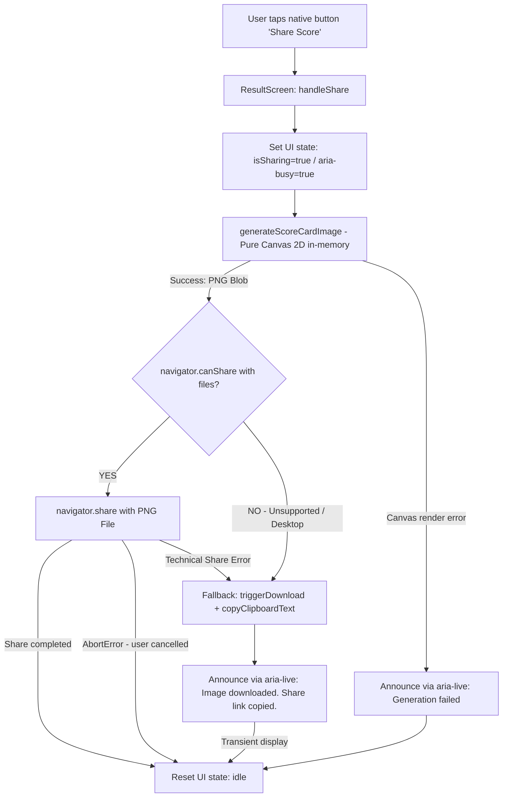

# Implementation Plan: Growth & Social ScoreCard Share

**Feature Identifier**: `specs/002-growth-share`  
**Spec Reference**: [`specs/002-growth-share/spec.md`](file:///home/hasashi/Bureau/SLEEPMAXX/specs/002-growth-share/spec.md)  
**Research Reference**: [`specs/002-growth-share/research.md`](file:///home/hasashi/Bureau/SLEEPMAXX/specs/002-growth-share/research.md)  
**Date**: 2026-09-18  

---

## 1. Summary

Implements the zero-dependency social sharing pipeline for the Sleepmaxx score result. Isolates the visual `<ScoreCard />` from application controls in `ResultScreen`, introduces a lightweight native Canvas 2D image generator producing a standardized 9:16 vertical PNG asset ($1080 \times 1920\text{ px}$), orchestrates the Web Share API (`navigator.share` with `File`) with an explicit download fallback and separate companion clipboard text copy, isolates `AbortError` to prevent unwanted side-effects, and provides a fully accessible native `<button type="button">` with transient polite live region announcements.

---

## 2. Technical Context

* **Language / Platform**: TypeScript 6.0 (Strict mode, zero `any`), React 19, Native HTML5 Canvas 2D.
* **External Dependencies Added**: **0** (Zero npm packages).
* **Target Output**: $1080 \times 1920\text{ px}$ PNG Blob (`image/png`), ratio 9:16.
* **Supported APIs**: Web Share API Level 2 (`navigator.canShare`, `navigator.share`), Clipboard API (`navigator.clipboard.writeText`), Canvas 2D API (`canvas.toBlob`).
* **Performance Budget & Target**: In-memory asset generation designed for low execution latency within the transient user gesture context; empirically validated via benchmark testing.
* **Testing Stack**: Vitest 4.1.11 with Node/jsdom canvas context mocks.

---

## 3. Constitution & PRD Governance Check

1. **Source of Truth Supremacy**: PASSED. Adheres directly to `docs/PRD.md` Section 9, 11.1, 15, and 16.3.
2. **Pure Scoring Engine Untouched**: PASSED. Zero lines modified in `src/core/scoringEngine.ts` or `SCORING_SPEC.md`.
3. **Zero-Budget & Local-First**: PASSED. 100% on-device client execution; zero server or external API costs.
4. **Zero Unnecessary Dependencies**: PASSED. Pure native Canvas 2D API; zero npm packages added.
5. **Non-Medical Wellness Positioning**: PASSED. Disclaimers preserved verbatim on both UI and exported image asset.

---

## 4. Architecture & Component Blueprint



### 4.1 Component Refactoring & Capture Boundary Isolation
* **Current State**: `ScoreCard.tsx` renders both the visual score content and the `<button>Retake Quiz</button>` inside `.scorecard-container`.
* **Refactored Architecture**:
  * `ScoreCard.tsx` becomes a pure visual representation of the scorecard (watermark, score hero, archetype badge, weakness callout, breakdown bars, legal notice).
  * `ResultScreen.tsx` renders `<ScoreCard result={result} />` as the visual card surface, and renders the application action controls in a separate container below:
    * Primary Action: Native `<button type="button" className="share-score-btn" disabled={isSharing} aria-busy={isSharing}>Share Score</button>` (strictly omitting redundant `role="button"`, touch target $\ge 52\text{px}$, focus-visible ring).
    * Secondary Action: Native `<button type="button" className="retake-quiz-btn" onClick={onRetake}>Retake Quiz</button>`.
    * Feedback Live Region: Sibling `<div role="status" aria-live="polite">` for transient status announcements.

### 4.2 Canvas 2D Engine (`src/features/quiz/utils/generateScoreCardImage.ts`)
* Pure function: `generateScoreCardImage(result: SleepmaxxResult): Promise<Blob>`
* Direct drawing specifications:
  * Width: $1080\text{px}$, Height: $1920\text{px}$.
  * Background: Solid deep dark `#0B0F17` with radial gradient glow.
  * Header Watermark: `SLEEPMAXX ROUTINE ENGINE` (0.8em tracking) + `sleepmaxx.app`.
  * Score Hero: Giant numeric score in tier color (Emerald `#10B981` $\ge 75$, Amber `#F59E0B` $60-74$, Rose `#EF4444` $<60$).
  * Archetype Pill: Rounded rectangle pill with uppercase archetype label (`COOKED`, `ZOMBIE`, `RECOVERING`, `SLEEPMAXXED`, `ELITE`).
  * Weakness Box: Deducted points highlight (`Biggest Weakness: [Category] (-X pts)`).
  * Category Breakdown: 5 progress bars with earned points and labels.
  * Footer: `"Can you reach 90 in 7 days? Take the free routine quiz on sleepmaxx.app"` + Non-Medical Wellness Notice.

### 4.3 Share Orchestrator (`src/features/quiz/utils/shareScore.ts`)
* Pure functional service: `shareSleepmaxxScore(result: SleepmaxxResult, options?: ShareOptions): Promise<ShareResult>`
* Sharing strategy details:
  1. **Primary File Share**: If `navigator.share` and `navigator.canShare?.({ files: [file] })` are true, invoke `navigator.share({ title, text, files: [file] })`.
  2. **Rejection of Text-Only Web Share**: Automated fallback to `navigator.share({ text, url })` without files is omitted because the core deliverable is the visual scorecard; text-only sharing drops the image and causes UI conflicts if combined with a file download.
  3. **Explicit Download Fallback**: When native file sharing is unavailable or encounters a technical error, initiate programmatic PNG download of `sleepmaxx-score.png`.
  4. **Companion Clipboard Text Copy**: On desktop / non-file environments, simultaneously attempt `navigator.clipboard.writeText(shareTextWithUrl)`. This is explicitly presented as copying the share link, never as an image copy.
  5. **AbortError Handling**: If the user dismisses the OS share sheet (`err.name === 'AbortError'`), catch the exception and immediately return `{ status: 'aborted' }`. Under NO circumstances trigger automatic download, clipboard writes, or failure alerts.
  6. **Technical Error Handling**: Non-abort errors (e.g. `NotAllowedError`, runtime exceptions) trigger the direct download fallback, log diagnostic details, and announce a polite recovery status if unrecoverable.

---

## 5. File System & Module Layout

```text
src/features/quiz/
├── components/
│   ├── ScoreCard.tsx             # PURE visual scorecard (removes interactive Retake button)
│   ├── ScoreCard.test.tsx        # Tests updated for pure visual boundary
│   ├── ResultScreen.tsx          # Renders ScoreCard + Share Score CTA + Retake CTA + feedback
│   └── ...
├── utils/
│   ├── generateScoreCardImage.ts # Pure Canvas 2D 1080x1920 PNG generator
│   ├── generateScoreCardImage.test.ts # Canvas mock unit tests & latency benchmark
│   ├── shareScore.ts             # Share orchestrator (File Share, Download, Clipboard, Abort)
│   └── shareScore.test.ts        # Unit tests for Web Share, Abort, Download, Clipboard
└── types.ts                      # ShareStatus & ShareResult types
```

---

## 6. Risk Mitigation & Verification Strategy

1. **Canvas in Vitest (jsdom)**: jsdom does not implement native Canvas 2D by default. In tests, we mock `document.createElement('canvas')` with a lightweight 2D context stub that simulates `toBlob` returning an `image/png` Blob.
2. **Gesture Expiration Risk & Validation Target**: By using direct in-memory Canvas 2D rendering rather than live DOM capture, execution bypasses DOM reflows and CSS recalculations, targeting minimal latency before calling `navigator.share`. A dedicated benchmark test will measure and validate generation execution times.
3. **Zero Regression**: All 165 existing tests must continue to pass untouched.
