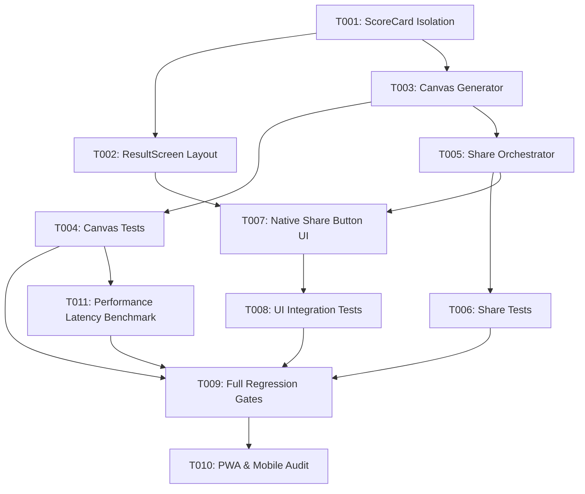

# Tasks: Growth & Social ScoreCard Share

**Feature**: `specs/002-growth-share`  
**Spec Reference**: [`specs/002-growth-share/spec.md`](file:///home/hasashi/Bureau/SLEEPMAXX/specs/002-growth-share/spec.md)  
**Plan Reference**: [`specs/002-growth-share/plan.md`](file:///home/hasashi/Bureau/SLEEPMAXX/specs/002-growth-share/plan.md)  
**Status**: Ready for Implementation  

---

## Phase 1: Boundary Isolation & Surface Refactoring

**Purpose**: Separate the visual scorecard surface from application action controls to ensure generated assets contain zero interactive UI buttons.

- [x] T001 [P] [SHARE] Refactor `src/features/quiz/components/ScoreCard.tsx` to be a pure visual card: remove internal interactive `onRetake` button, enrich `brand-watermark` with `sleepmaxx.app` URL, and preserve `forwardRef` on the card surface
- [x] T002 [P] [SHARE] Update `src/features/quiz/components/ResultScreen.tsx` to host application action buttons (`Retake Quiz` and placeholder for `Share Score`) as sibling controls outside `<ScoreCard />`, and update `ScoreCard.test.tsx` to verify isolation

**Checkpoint**: Pure visual surface isolated. `ResultScreen` handles actions. Existing 165 tests continue to pass.

---

## Phase 2: Native Canvas 2D Asset Generator

**Purpose**: Build a headless, zero-dependency Canvas 2D renderer producing a calibrated 9:16 vertical PNG image ($1080 \times 1920\text{ px}$) designed for low execution latency within the user gesture window.

- [x] T003 [P] [SHARE] Implement pure Canvas 2D asset generator in `src/features/quiz/utils/generateScoreCardImage.ts` ($1080 \times 1920\text{ px}$, deep dark background `#0B0F17`, radial glow, score hero, archetype pill, weakness highlight, 5 breakdown bars, `sleepmaxx.app` watermark, and disclaimer)
- [x] T004 [P] [SHARE] Create unit tests for Canvas generator in `src/features/quiz/utils/generateScoreCardImage.test.ts` (verify $1080 \times 1920$ output dimensions, MIME `image/png`, deterministic rendering, and score edge cases 0 and 100)

**Checkpoint**: Image asset generation verified in isolation without DOM or network dependencies.

---

## Phase 3: Defensive Share Orchestrator & Fallback Strategy

**Purpose**: Build the share service implementing Web Share API with File, direct PNG download fallback, separate companion clipboard text copy, and strict `AbortError` isolation.

- [x] T005 [P] [SHARE] Implement share orchestrator in `src/features/quiz/utils/shareScore.ts`:
  - Primary Native Share: `navigator.share({ title, text, files: [file] })` when `navigator.canShare?.({ files: [file] })` returns true
  - Rejection of Automated Text-Only Web Share: Avoid omitting the visual scorecard or colliding with mobile download dialogs
  - Explicit Download Fallback: Programmatic PNG download (`<a download="sleepmaxx-score.png">`) when file sharing is unavailable or encounters a technical error
  - Companion Clipboard Text Copy: Attempt `navigator.clipboard.writeText` for share text/URL (distinctly documented and announced as text copy, never image)
  - AbortError Isolation: Catch `AbortError` and return clean `{ status: 'aborted' }` with ZERO side-effects (no download, no clipboard, no error alert)
  - Technical Error Handling: Attempt download fallback; log error diagnostic; announce recovery status if unrecoverable
- [x] T006 [P] [SHARE] Create comprehensive unit tests for share service in `src/features/quiz/utils/shareScore.test.ts` (test native file share, explicit download fallback, companion text clipboard copy, `AbortError` clean reset with zero side-effects, and technical error fallback)

**Checkpoint**: Share orchestration verified across all platform capability scenarios.

---

## Phase 4: UI Integration & Accessible Feedback

**Purpose**: Expose the "Share Score" action in `ResultScreen` using a native `<button type="button">` (omitting redundant `role="button"`), with touch targets $\ge 52\text{px}$, visible keyboard focus, `disabled` & `aria-busy` during processing, and `aria-live="polite"` status announcements.

- [x] T007 [SHARE] Integrate native `<button type="button">` for "Share Score" in `src/features/quiz/components/ResultScreen.tsx`:
  - Native HTML `<button type="button">` (strictly omitting redundant `role="button"`)
  - Primary CTA positioned above "Retake Quiz"
  - Touch target min-height $52\text{px}$ with glowing accent styling and `:focus-visible` ring
  - States: `idle`, `loading` (`disabled`, `aria-busy="true"`), and transient feedback
  - Keyboard navigation (Tab, Enter, Space) and polite status announcements via sibling `
`
- [x] T008 [SHARE] Add integration tests for Share UI in `src/features/quiz/QuizContainer.test.tsx` (verify native button rendering without redundant role, loading state during generation, `aria-live` announcements distinguishing download from clipboard, clean reset on abort, and Retake Quiz persistence reset unchanged)

**Checkpoint**: End-to-end user flow from Result to Share Sheet / Download operational and tested.

---

## Phase 5: Performance Validation & Regression Gates

**Purpose**: Ensure zero regression across the existing test suite, measure asset generation latency, confirm zero scoring engine drift, zero new dependencies, and verified production PWA build.

- [ ] T009 [SHARE] Run automated verification suite: `npm test`, `npx tsc -b --noEmit`, `npm run lint`, and `npm run build`
- [ ] T010 [SHARE] Verify PWA offline compatibility and responsive behavior across mobile viewports (375px, 390px, 430px) ensuring zero horizontal scroll and clean layout
- [ ] T011 [SHARE] Validate asset generation latency via benchmark test (ensure Canvas rendering time is measured and verified to execute rapidly in memory to preserve user gesture context)

---

## Dependencies & Execution Order

