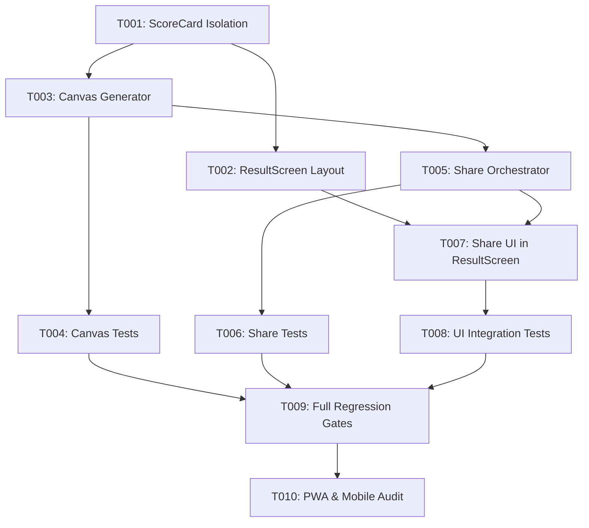

# Tasks: Growth & Social ScoreCard Share

**Feature**: `specs/002-growth-share`  
**Spec Reference**: [`specs/002-growth-share/spec.md`](file:///home/hasashi/Bureau/SLEEPMAXX/specs/002-growth-share/spec.md)  
**Plan Reference**: [`specs/002-growth-share/plan.md`](file:///home/hasashi/Bureau/SLEEPMAXX/specs/002-growth-share/plan.md)  
**Status**: Ready for Implementation  

---

## Phase 1: Boundary Isolation & Surface Refactoring

**Purpose**: Separate the visual scorecard surface from application action controls to ensure generated assets contain zero interactive UI buttons.

- [ ] T001 [P] [SHARE] Refactor `src/features/quiz/components/ScoreCard.tsx` to be a pure visual card: remove internal interactive `onRetake` button, enrich `brand-watermark` with `sleepmaxx.app` URL, and preserve `forwardRef` on the card surface
- [ ] T002 [P] [SHARE] Update `src/features/quiz/components/ResultScreen.tsx` to host application action buttons (`Retake Quiz` and placeholder for `Share Score`) as sibling controls outside `<ScoreCard />`, and update `ScoreCard.test.tsx` to verify isolation

**Checkpoint**: Pure visual surface isolated. `ResultScreen` handles actions. Existing 165 tests continue to pass.

---

## Phase 2: Native Canvas 2D Asset Generator

**Purpose**: Build a headless, zero-dependency Canvas 2D renderer producing a calibrated 9:16 vertical PNG image ($1080 \times 1920\text{ px}$) in $<25\text{ms}$.

- [ ] T003 [P] [SHARE] Implement pure Canvas 2D asset generator in `src/features/quiz/utils/generateScoreCardImage.ts` ($1080 \times 1920\text{ px}$, deep dark background `#0B0F17`, radial glow, score hero, archetype pill, weakness highlight, 5 breakdown bars, `sleepmaxx.app` watermark, and disclaimer)
- [ ] T004 [P] [SHARE] Create unit tests for Canvas generator in `src/features/quiz/utils/generateScoreCardImage.test.ts` (verify $1080 \times 1920$ output dimensions, MIME `image/png`, deterministic rendering, and score edge cases 0 and 100)

**Checkpoint**: Image asset generation verified in isolation without DOM or network dependencies.

---

## Phase 3: Defensive Share Orchestrator & Multi-Tier Fallback

**Purpose**: Build the 4-level share service implementing Web Share API with File, Web Share text fallback, direct PNG download, and clipboard copy.

- [ ] T005 [P] [SHARE] Implement share orchestrator in `src/features/quiz/utils/shareScore.ts`:
  - Level 1: `navigator.canShare({ files })` $\rightarrow$ `navigator.share({ title, text, url, files: [file] })`
  - Level 2: `navigator.share({ title, text, url })` + programmatic image download
  - Level 3: Programmatic PNG download (`<a download="sleepmaxx-score.png">`)
  - Level 4: `navigator.clipboard.writeText` copy fallback
  - Abort Handling: Catch `AbortError` and return clean `{ status: 'aborted' }` without throwing
- [ ] T006 [P] [SHARE] Create comprehensive unit tests for share service in `src/features/quiz/utils/shareScore.test.ts` (test Level 1 native file share, Level 2 text share + download, Level 3 direct download, Level 4 clipboard copy, and `AbortError` graceful handling)

**Checkpoint**: Share orchestration verified across all platform capability scenarios.

---

## Phase 4: UI Integration & Accessible Feedback

**Purpose**: Expose the "Share Score" action in `ResultScreen` with touch targets $\ge 52\text{px}$, visible keyboard focus, loading state, and transient status announcements.

- [ ] T007 [SHARE] Integrate "Share Score" button in `src/features/quiz/components/ResultScreen.tsx`:
  - Primary CTA positioned above "Retake Quiz"
  - Touch target min-height $52\text{px}$ with glowing accent styling
  - States: `idle`, `loading` (`aria-busy="true"`), and transient `success` / `feedback` banner
  - Keyboard navigation (Tab, Enter, Space) and `aria-live="polite"` feedback announcement
- [ ] T008 [SHARE] Add integration tests for Share UI in `src/features/quiz/QuizContainer.test.tsx` (verify Share Score button render, loading state during generation, feedback on download/clipboard, and Retake Quiz persistence reset unchanged)

**Checkpoint**: End-to-end user flow from Result to Share Sheet / Download operational and tested.

---

## Phase 5: Regression Gates & Final Validation

**Purpose**: Ensure zero regression across the existing test suite, zero scoring engine drift, zero new dependencies, and verified production PWA build.

- [ ] T009 [SHARE] Run automated verification suite: `npm test`, `npx tsc -b --noEmit`, `npm run lint`, and `npm run build`
- [ ] T010 [SHARE] Verify PWA offline compatibility and responsive behavior across mobile viewports (375px, 390px, 430px) ensuring zero horizontal scroll and clean layout

---

## Dependencies & Execution Order

